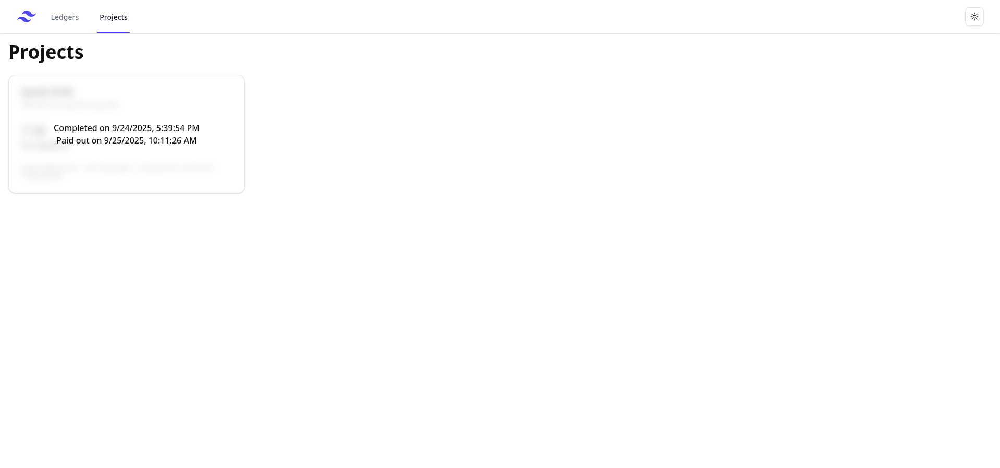

# OpenLedger

A Simple Open Source public ledger.

Features:

- Ledgers

- Projects

- Groups

- Persons

- Refunds

- Transactions

- Payouts

- Disabled signup (reenable in `lib/auth.ts`)

## Get started

This is designed to be hosted on vercel with a neon serverless database. (although nothing prevents you from changing out the adapter in `lib/index.ts`)

To get started, clone this repository, set the required env variables and run `vercel --prod` to deploy. Dont forget to apply the DB schema using `bunx drizzle-kit push`.

To create an admin account, run a dev deployment connecting to the same DB using `bun install` and `bun run dev` and change the signup setting in `auth.ts`.